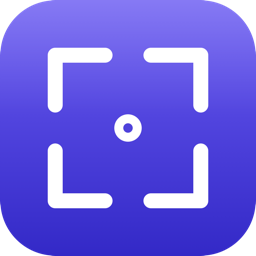

<div align="center">
  
  <h1>Klik</h1>
  <p><strong>Fast, native macOS screen capture and recording — built for Apple Silicon.</strong></p>

  <p>
    
    
    
    
    <a href="https://codigit.io/apps/klik.html"></a>
    <a href="https://buymeacoffee.com/marino143"></a>
  </p>
</div>

---

**Klik** is a lightweight macOS screen capture and recording utility inspired by CleanShot.
It lives in your menu bar, captures screenshots and video, and gets out of your way.
No subscription, no telemetry, no Electron — just a 700 KB native `.app`.

## Features

### 📸 Screenshots
- **Region**, **window**, and **full-screen** capture via ScreenCaptureKit
- **Annotation editor**: rectangle, arrow, text, highlight, gaussian blur, crop
- **Pin to Screen**: float a screenshot above all other windows
- **Auto-copy** to clipboard, **auto-save** to your chosen folder (default: Desktop)

### 🎥 Video Recording
- **Full-screen** or **region** recording, 30 fps H.264 MP4
- Records **system audio** *and* **microphone** — ideal for capturing meetings
- Optional **mix audio tracks into one** for sharing-friendly single-track MP4
- **Convert MP4 → GIF** (12 fps, optimized) in one click
- Floating control bar with REC indicator, live timer, stop and cancel buttons
- Klik's own windows are excluded from the recording automatically

### 🗂 Quick Access Overlay
- After every capture, a thumbnail slides in at the bottom-left corner
- **Drag** it directly into any app — Finder, Slack, Mail, browser uploads, anything that accepts files
- Multiple captures **stack vertically** and stay visible until you dismiss them
- Hover for **Open** / **Edit** / **Save** buttons; right-click for full action menu

## Keyboard Shortcuts

| Shortcut | Action |
|---|---|
| <kbd>⇧⌘2</kbd> | Capture region |
| <kbd>⇧⌘3</kbd> | Capture full screen |
| <kbd>⇧⌘4</kbd> | Capture window |
| <kbd>⇧⌘5</kbd> | Record video (full screen) |
| <kbd>⌘,</kbd> | Settings |
| <kbd>⌘Q</kbd> | Quit Klik |
| <kbd>Esc</kbd> | Cancel current capture |

## Installation

1. Download `Klik.app.zip` from the [latest release](https://github.com/marino143/klik/releases/latest)
2. Unzip → drag **Klik.app** into `/Applications`
3. First launch is blocked by Gatekeeper — the release build is signed but **not yet notarised**, so macOS refuses to open it until you allow it once:
   - Double-click **Klik.app**, then dismiss the warning
   - Open **System Settings → Privacy & Security**, scroll to *Security*, and click **Open Anyway** next to Klik
   - Confirm, and Klik launches

   On macOS 14 right-clicking the app and choosing **Open** does the same thing in one step; from macOS 15 onwards that shortcut no longer bypasses Gatekeeper. If you prefer the terminal, `xattr -d com.apple.quarantine /Applications/Klik.app` clears the flag outright.
4. Look for the camera-viewfinder icon in your menu bar
5. Press <kbd>⇧⌘3</kbd> — macOS will prompt for **Screen Recording** permission. Grant it, then **Quit & Reopen** Klik
6. The first time you record video, you'll also be prompted for **Microphone** access

## Build from Source

Requires macOS 14+, Xcode 15+, Swift 5.10+, Apple Silicon.

```bash
git clone https://github.com/marino143/klik.git
cd klik
./build.sh debug
open build/Klik.app
```

To sign with your own Apple Developer certificate, set `KLIK_SIGN_IDENTITY`:

```bash
KLIK_SIGN_IDENTITY="Apple Development: Your Name (XXXXXXXXXX)" ./build.sh release
```

`build.sh` signs with an Apple Development certificate, which is fine locally but is rejected by Gatekeeper on any other Mac. `release.sh` builds the distributable instead — Developer ID signature, hardened runtime, notarised by Apple and stapled:

```bash
./release.sh 0.2.0
```

Notarisation needs App Store Connect credentials, stored once in your keychain (see the header of `release.sh`).

To regenerate the app icon from the source script:

```bash
./scripts/build_icns.sh
```

## Architecture

| Layer | Technology |
|---|---|
| Language | Swift 5.10 |
| UI | AppKit + SwiftUI |
| Screenshot | ScreenCaptureKit (`SCScreenshotManager`) |
| Video | ScreenCaptureKit (`SCStream`) + AVAssetWriter |
| Audio | System audio via SCStream, microphone via SCStream (macOS 15+) |
| Audio mixing | AVAssetReader / AVAssetWriter (passthrough video, PCM sum + AAC re-encode) |
| GIF | ImageIO + AVAssetImageGenerator |
| Global hotkeys | Carbon Event Manager |
| Build | Swift Package Manager + custom `build.sh` |

**Zero third-party dependencies.** Everything runs on first-party Apple frameworks.

## File Size Estimates

Klik records HEVC (H.265) at a 1080p ceiling — sized for sharing meeting recordings on Slack / Drive / email without a separate re-compression pass. Defaults: ~1.5 bits/pixel, capped at 6 Mbps, plus two AAC audio tracks (128 kbps each).

| What you record | Per minute | 30 min | 1 hour |
|---|---|---|---|
| 1080p region (or any full-screen, downscaled to 1080p) | ~25 MB | ~750 MB | ~1.5 GB |
| 720p region | ~12 MB | ~360 MB | ~720 MB |
| Audio only (both tracks) | ~2 MB | ~60 MB | ~115 MB |

Source captures larger than 1080p (1440p, 4K, 5K) are downscaled by ScreenCaptureKit before encoding, so a full-screen recording on a 5K display still produces a 1080p MP4. This keeps memory use and file size predictable.

## Roadmap

Things on the wishlist that aren't shipped yet:

- HEVC codec option (≈40% smaller files at the same quality)
- Recording quality presets (Low / Medium / High)
- OCR — copy text out of screenshots
- Scrolling capture
- Cloud upload (S3, custom endpoint)
- Editing annotations after creation
- Drag-out without auto-closing the overlay
- Notarization for distribution outside the developer's devices

Open an issue if you want one of these, or send a PR.

## Why Klik

I use CleanShot every day. I wanted to see how close I could get to its core experience with a Saturday-afternoon side project — no Electron, no third-party deps, just native macOS frameworks on Apple Silicon. The result is a single 700 KB binary that does the things I actually use a screen-capture tool for.

If you find it useful, star the repo. If something's missing, open an issue.

## Support

If Klik saved you a CleanShot subscription or a HandBrake round-trip, consider [buying me a coffee](https://buymeacoffee.com/marino143) ☕. No pressure — the app is and stays free.

## License

MIT — see [LICENSE](LICENSE).

## Author

Built by **Marino Glazar** ([@marino143](https://github.com/marino143)).
